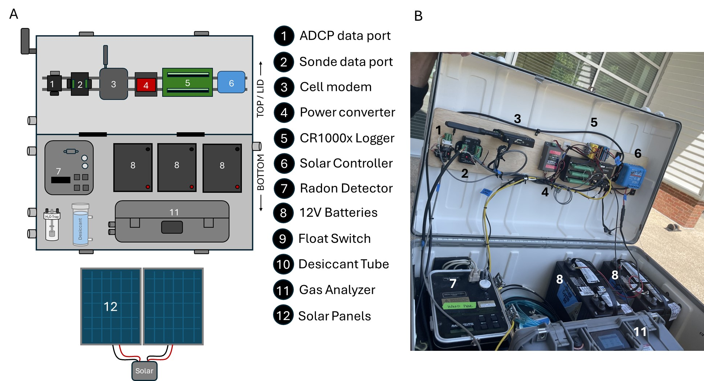

# SARGEtools

### Tools developed for use with SARGE (Semi-Autonomous Radon and Greenhouse Gas Equilibrator) system data.




## Overview

This R package includes useful functions for working with SARGE data, as well as template code for data reports (template_markdown) and a real-time data dashboard (template_dashboard).

The template_markdown directory contains code and a pdf vignette to walk users through downloading the package from GitHub, developing configuration files, reading in data, and plotting data. A description of how to adapt dashboard code for new applications is provided in template_description. Briefly, the main change is to update file paths in `./template_dashboard/config` to match where data is stored. 


## Installation 

You can install SARGEtools from [Github](https://github.com/) with: 

```r
# install.packages("remotes")
remotes::install_github("Smithsonian/SARGEtools")
```


## Functions 

`sarge_read`: Used to read in SARGE data logger data tables 

`sarge_plot_defaults`: Plots SARGE variables determined to be default data for a specified data_type across a given date range 

`sarge_plot_custom`: Plots SARGE specified variables data for a specified data_type across a given date range 


## Next Steps 

See the [template_markdown](https://github.com/Smithsonian/SARGEtools/blob/main/template_markdown/SARGEtools_markdown.pdf) for detailed information about using these functions. 

